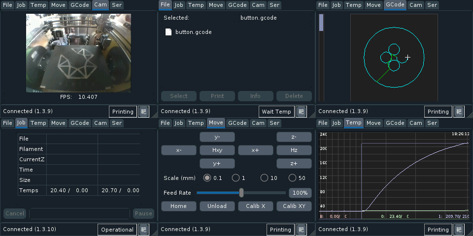

tentacle - An OctoPrint frontend for small displays
###################################################



.. class:: no-web no-pdf

|pypi| |unix_build|

.. contents::

.. section-numbering::

Features
========

* Stylus-friendly UI suitable for tiny TFTs
* TFT Resolution of 320x240 and upwards supported
* Low resource usage: PyQt5 running directly on framebuffer without X11
* All relevant OctoPrint parameters are available in UI Tabs:

  * Shows details on current print ``Job``
  * Shows available print ``Files`` and allows to select one for printing
  * Shows ``Temperature Curves`` of Hotends and Bed
  * A ``Move Panel`` allows to move the tools
  * A ``GCode Display`` shows the current layer while printing
  * A ``Camera View`` shows your streamed camera

Installation
============

Linux / Raspberry Pi
--------------------

* First setup your TFT and the (calibrated) touch input.
  Typically your TFT's framebuffer device is ``/dev/fb1```
  See `Appendix`_ for details on my setup.

* Install the PyQt5 package for Python 3 with ``apt``:

.. code-block:: bash

    $ sudo apt install python3-pyqt5

* Install ``tentacle`` with ``pip``

.. code-block:: bash

    $ sudo apt install python3-pip
    $ pip3 install tentacle

macOS
-----

You can run ``tentacle`` on your Mac in a window to test the UI.

* First install PyQt5 with:

.. code-block:: bash

    $ pip install pyqt5

* Then install ``tentacle``:

.. code-block:: bash

    $ pip install tentacle


Appendix
========

Raspberry Camera Setup
----------------------

In my OctoPi_ based setup I added a Raspberry Pi Cam.
In order to make it work I enabled the ``Video4Linux`` driver in
``/etc/modules``::

    bcm2835_v4l2

If the image has the wrong orientation you can flip it in any direction with
the ``v4l2-ctl`` tool found in the ``v4l-utils`` package.::

    v4l2-ctl --set-ctrl vertical_flip=1 --set-ctrl horizontal_flip=1

To make this change persistet simply add the line to ``/etc/rc.local``.

The camera is then auto detected by ``mjpeg streamer`` running on the OctoPi
system.

.. _OctoPi: https://octoprint.org/download/

Setup an Adafruit PiTFT Plus 2.8"
---------------------------------

Adafruit_ offers a nice small 2.8" display with 320 x 240 pixels, a resistive
touch panel and four hard keys.

Follow the Instructions_ for initial setup. It boils down to adding the HAT
in ``/etc/config.txt`` with::

    dtparam=spi=on
    dtparam=i2c1=on
    dtparam=i2c_arm=on
    dtoverlay=pitft28-resistive,rotate=90,speed=64000000,fps=30

Note the *rotation of 90 degrees* so I can use landscape mode with the correct
orientation.

.. _Adafruit: https://www.adafruit.com/product/2298
.. _Instructions: https://learn.adafruit.com/adafruit-pitft-28-inch-resistive-touchscreen-display-raspberry-pi

Setup Hard keys
+++++++++++++++

Hard keys are not essential to run *tentacle*, but they offer useful functions
including controlling of the backlight without the need for touching.

The following GPIOs are connected to the PiTFT+ Hardkeys (from top to bottom):

* 17
* 22
* 23
* 27

I added a device tree file that maps these to the following input keys (see
the `Linux Kernel input event header`_ for the codes):

* 17: Escape (code 1)
* 22: Cursor Up (code 103)
* 23: Enter (code 28)
* 27: Cursor Down (code 108)

Enter the directory ``contrib/pitft-keys`` and run the the supplied
``Makefile`` there to build the device tree overlay binary and
install it in `/boot/`.

.. code-block:: bash

    $ cd contrib/pitft-keys
    $ make install

Note: It will ask for your user password to install the file via ``sudo``.

.. _Linux Kernel input event header: https://github.com/torvalds/linux/blob/master/include/uapi/linux/input-event-codes.h

Touchscreen Calibration
+++++++++++++++++++++++

It is essential to calibrate your touchscreen. Otherwise exact picking of UI
elements with a stylus or even your fingers is not possible.

PyQt5 in frame buffer mode is compiled for Raspbian to use libinput_ for
receiving touch panel events.

Unfortunately, all documented ways I found on the net either assume ``tslib``
or even ``X11`` support for calibration. Here is my own way I found with lots
trial and error.

.. _libinput: https://www.freedesktop.org/wiki/Software/libinput/

Running the Calibration Tool on X11
...................................

Yes, we want to run on frame buffer only but the only calibration tool I found
still uses X11. So we install a minimal X11 runtime just to start the tool.

A minimal X11 server can be installed with:

.. code-block:: bash

    sudo apt-get install xserver-xorg xserver-xorg-video-fbdev xinit

Edit ``/etc/X11/Xwrapper.config`` to allow everybody to start the server::

    ...
    allowed_users=anyboady

Now selec the frame buffer of your display to run X11 on. My display uses
``/dev/fb1``. Edit ``/usr/share/X11/xorg.conf.d/99-fbdev.conf``::

    Section "Device"
    Identifier "myfb"
    Driver "fbdev"
    Option "fbdev" "/dev/fb1"
    EndSection

Now run the X11 server once (preferrably from a ssh shell):

.. code-block:: bash

    $ startx &

Make sure your current calibration matrix is reset:

.. code-block:: bash

    $ DISPLAY=:0.0 xinput set-prop "stmpe-ts" 'Coordinate Transformation Matrix' 1 0 0 0 1 0 0 0 1

Run the calibration tool with:

.. code-block:: bash

    $ DISPLAY=:0.0 ./xtcal -geometry 320x240

Pick the drawn crosshairs with a stylus each and after that you get the matrix
reported::

    xinput set-prop <device name> 'Coordinate Transformation Matrix' 0.015731 -1.135927 1.014818 1.123037 0.017117 -0.062198 0 0 1

We are interested in the values of this matrix! So copy them in your
clipboard.

Stop the X11 server as it is not needed anymore:

.. code-block:: bash

    $ pkill startx

Save the Calibration Matrix for ``libinput``
............................................

We need to assign the calibration matrix in an environment variable called
``LIBINPUT_CALIBRATION_MATRIX``. This variable has to be set any time the
touchpanel device is detected and setup.

The PiTFT installer already has created a ``udev`` rule file
that creates a ``input/touchscren`` link for the touchpanel device.
In ``/etc/udev/rules.d/95-stmpe.rules`` we add the environment variable::

    SUBSYSTEM=="input", ATTRS{name}=="*stmpe*", ENV{DEVNAME}=="*event*", SYMLINK+="input/touchscreen", ENV{LIBINPUT_CALIBRATION_MATRIX}="0.015731 -1.135927 1.014818 1.123037 0.017117 -0.062198"

Note that only the first 6 values of the matrix are used here.

Reboot your Pi to make this matrix active.

You can check if the matrix is setup correctly with the
``libinput-list-devices``` tool.

.. code-block:: bash

    $ sudo libinput-list-devices
    Device:           stmpe-ts
    ...
    Calibration:      0.02 -1.14 1.01 1.12 0.02
